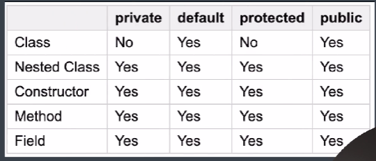
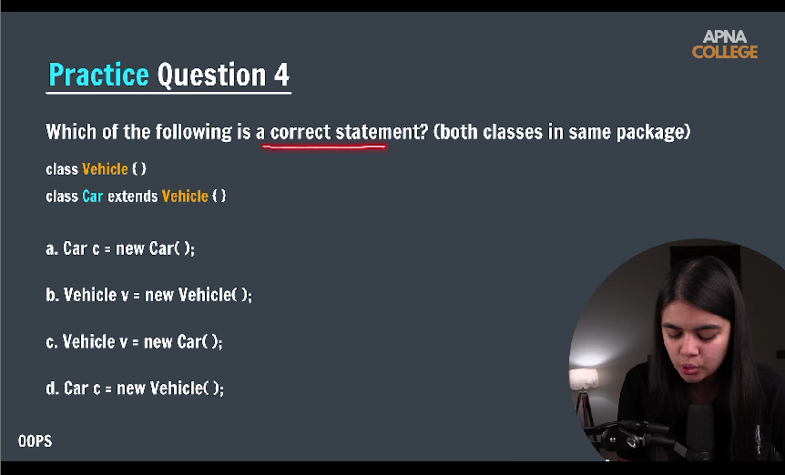

Q1. which of the following modifiers are not allowed in front of class 

a. private ...in java class are not private 
b. protected ..in java class are not protected
c. public 
d. default

=======================================================================================
Q2 .

parent refrence =  child object ==> this cab be possible but 
child refrence = parent object ==> this cannot be possible 
thus option a, b & c are correct 

============================================================================
